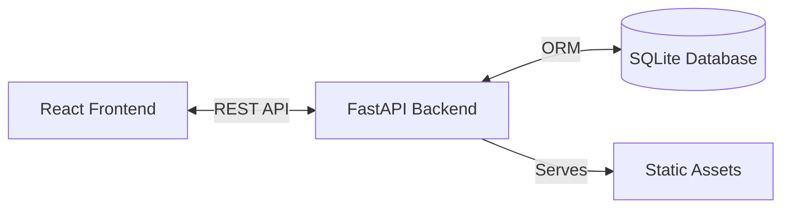

# 👗 101 Dresses
### A Trust-First Resale Platform for Occasion Wear

---

## 📌 Problem Statement

Most fashion resale platforms fail due to:
- Fake returns and item swapping
- False damage claims
- Unsafe and premature payments
- Emotion-based disputes
- No control over logistics

These issues break seller trust and make resale of high-value dresses unsafe.

---

## 💡 Our Solution

**101 Dresses** is a secure resale platform for **wedding, festive, and party wear** that **controls the entire transaction lifecycle**.

We prevent fraud by controlling:
- **Custody** (platform-managed pickup & delivery)
- **Money** (escrow-based payments)
- **Evidence** (mandatory videos and photos)

> If the platform controls custody, money, and proof — fraud becomes irrational.

---

## 🚀 Features

- **🛡️ Secure Authentication**: User signup and login protected by JWT authentication.
- **💰 Escrow System**: Payments are held in a secure escrow balance until the buyer confirms the item or the inspection period ends.
- **🛍️ Managed Marketplace**: Browse high-value items with detailed condition reports.
- **📸 Evidence-Based**: Mandatory photo/video evidence for listings and disputes.
- **✅ Verification**: Admin-verified listings (simulated in this demo).
- **⏱️ Inspection Window**: 48-hour automated timer for buyers to inspect items before funds are released.

---

## 📸 Screenshots

| Dashboard | Item Details |
|-----------|--------------|
|  |  |

| Categories | Featured Items |
|------------|----------------|
|  |  |

---

## 🛠️ Technical Architecture

The project follows a modern client-server architecture:

### Tech Stack
- **Frontend**: [React](https://react.dev/) + [Vite](https://vitejs.dev/)
  - **Styling**: Tailwind CSS + Radix UI (shadcn/ui)
  - **State/Data**: React Query
- **Backend**: [FastAPI](https://fastapi.tiangolo.com/) (Python)
  - **Database**: SQLModel (SQLite)
  - **Auth**: Python-Jose (JWT), Passlib (Bcrypt)

### High-Level Flow


---

## 🏁 Getting Started

### Prerequisites
- **Python** (3.9 or higher)
- **Node.js** (18 or higher)

### Quick Start (Windows)
The easiest way to run the project is using the helper script:

1. Double-click **`start_dev.bat`** in the project root.
2. This will:
   - Install Python dependencies.
   - Start the Backend server on `http://localhost:8001`.
   - Install Node.js dependencies.
   - Start the Frontend dev server.

### Manual Setup

If you prefer to run services manually:

#### 1. Backend
```powershell
pip install fastapi uvicorn sqlmodel python-jose[cryptography] passlib[bcrypt] python-multipart
python -m uvicorn backend.main:app --reload --port 8001
```
*Server running at: http://localhost:8001*

#### 2. Frontend
```powershell
cd frontend
npm install
npm run dev
```
*App running at: usually http://localhost:5173*

---

## 📂 Project Structure

```
101-dress/
├── backend/            # FastAPI Application
│   ├── main.py         # App entry point & endpoints
│   ├── models.py       # Database models (User, Item, Order)
│   └── database_v2.db  # SQLite Database
├── frontend/           # React Application
│   ├── src/            # Source code
│   └── public/         # Static assets
├── start_dev.bat       # Startup script
└── README.md           # Documentation
```
